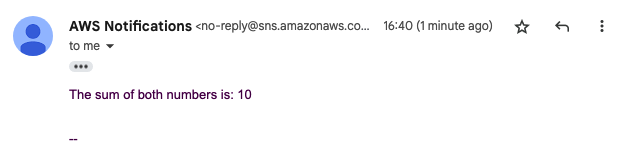
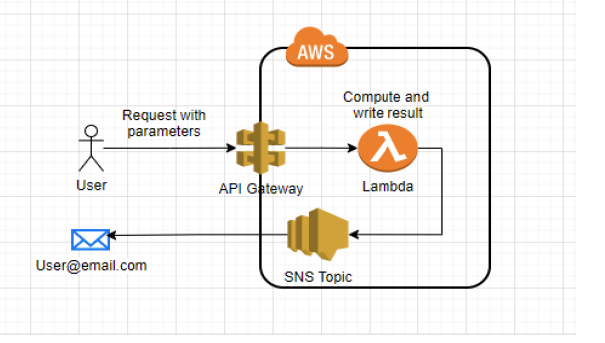

# Lambda function behind API Gateway
## Serverless Lambda function that calculates the sum number of two numbers provided by the user in json format
## Tools : Lambda | AWS SNS | IAM | PYTHON | API GATEWAY


Testing the function can be done by running : 
```
curl -X POST -H "Content-Type: application/json" -d '{"num1": 5, "num2": 5}' <API Gateway Target URL> 
```
### Response body example : 
```
{"statusCode": 200, "body": "{\"result\": 10}"}%    
```

### Response email example :  <br>
 <br>


## Architecture 


